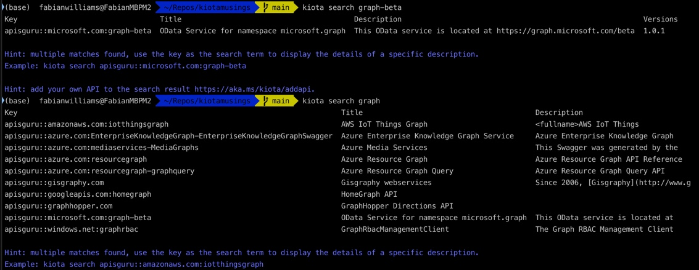

# Using Kiota to Explore and Generate Clients for Various APIs

## Searching for APIs

To search for available APIs using Kiota, you can use the `kiota search` command. Below are examples of searching for APIs related to Microsoft Graph Beta and other services.

### Searching for Microsoft Graph Beta API

```shell
kiota search graph-beta


#### Output:

| Key                                    | Title                                 | Description                                                               | Versions |
|----------------------------------------|---------------------------------------|---------------------------------------------------------------------------|----------|
| apisguru::microsoft.com:graph-beta     | OData Service for namespace microsoft.graph | This OData service is located at https://graph.microsoft.com/beta | 1.0.1    |

> Hint: multiple matches found, use the key as the search term to display the details of a specific description.
Example: `kiota search apisguru::microsoft.com:graph-beta`

> Hint: add your own API to the search result [https://aka.ms/kiota/addapi](https://aka.ms/kiota/addapi).

### Searching for Various Graph APIs

```shell
kiota search graph


#### Output:

| Key                                           | Title                                      | Description                                            | Versions |
|-----------------------------------------------|--------------------------------------------|--------------------------------------------------------|----------|
| apisguru::amazonaws.com:iotthingsgraph        | AWS IoT Things Graph                       | <fullname>AWS IoT Things                               |          |
| apisguru::azure.com:EnterpriseKnowledgeGraphSwagger | Azure Enterprise Knowledge Graph Service   | Azure Enterprise Knowledge Graph Service               |          |
| apisguru::azure.com:mediaservices-MediaGraphs | Azure Media Services                       | This Swagger was generated by the Azure Media Services |          |
| apisguru::azure.com:resourcegraph             | Azure Resource Graph                       | Azure Resource Graph API Reference                     |          |
| apisguru::azure.com:resourcegraph-graphquery  | Azure Resource Graph Query                 | Azure Resource Graph Query API                         |          |
| apisguru::gisgraphy.com                       | Gisgraphy webservices                      | Since 2006, [Gisgraphy](http://www.gisgraphy.com)      |          |
| apisguru::googleapis.com:homegraph            | HomeGraph API                              |                                                        |          |
| apisguru::graphhopper.com                     | GraphHopper Directions API                 |                                                        |          |
| apisguru::microsoft.com:graph-beta            | OData Service for namespace microsoft.graph | This OData service is located at https://graph.microsoft.com/beta | 1.0.1    |
| apisguru::windows.net:graphrbac               | The Graph RBAC Management Client           |                                                        |          |



